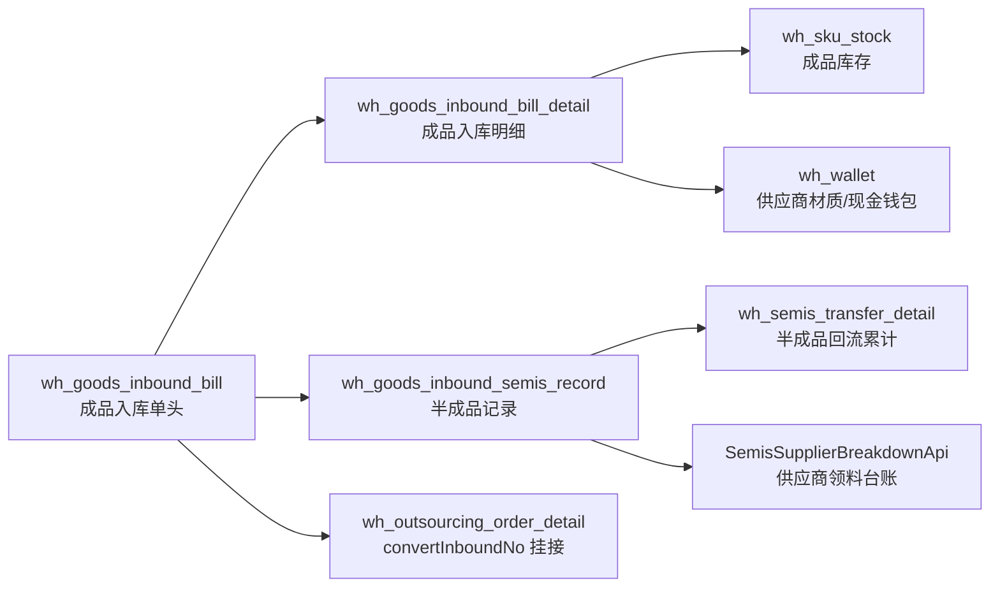

# 成品入库单实体图

```mermaid
flowchart LR
    A["wh_goods_inbound_bill\n成品入库单头"] --> B["wh_goods_inbound_bill_detail\n成品入库明细"]
    A --> C["wh_goods_inbound_semis_record\n半成品记录"]
    B --> D["wh_sku_stock\n成品库存"]
    B --> E["wh_wallet\n供应商材质/现金钱包"]
    C --> F["wh_semis_transfer_detail\n半成品回流累计"]
    C --> G["SemisSupplierBreakdownApi\n供应商领料台账"]
    A --> H["wh_outsourcing_order_detail\nconvertInboundNo 挂接"]
```

## 说明
1. 普通成品入库至少影响成品库存和供应商钱包
2. 转成品入库/供应商退料还会影响半成品回流量与供应商领料台账
3. 作废会解除委外明细上的 `convertInboundNo`
