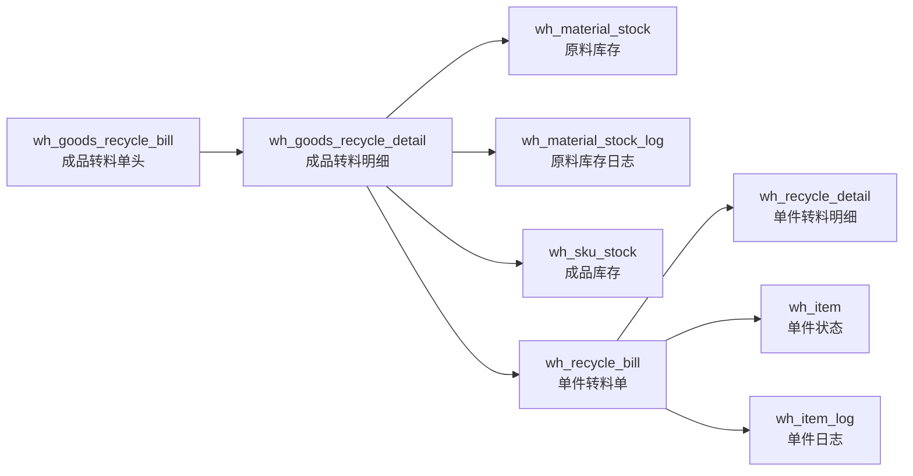

# 成品转料单实体图

```mermaid
flowchart LR
    A["wh_goods_recycle_bill\n成品转料单头"] --> B["wh_goods_recycle_detail\n成品转料明细"]
    B --> C["wh_material_stock\n原料库存"]
    B --> D["wh_material_stock_log\n原料库存日志"]
    B --> E["wh_sku_stock\n成品库存"]
    B --> F["wh_recycle_bill\n单件转料单"]
    F --> G["wh_recycle_detail\n单件转料明细"]
    F --> H["wh_item\n单件状态"]
    F --> I["wh_item_log\n单件日志"]
```

## 说明
1. 不带 `itemNo` 的明细只走“成品库存 + 原料库存”主链。
2. 带 `itemNo` 的明细会继续下钻单件转料子链。
3. 原料库存统一写到单头 `destWareId + materialNo`。
