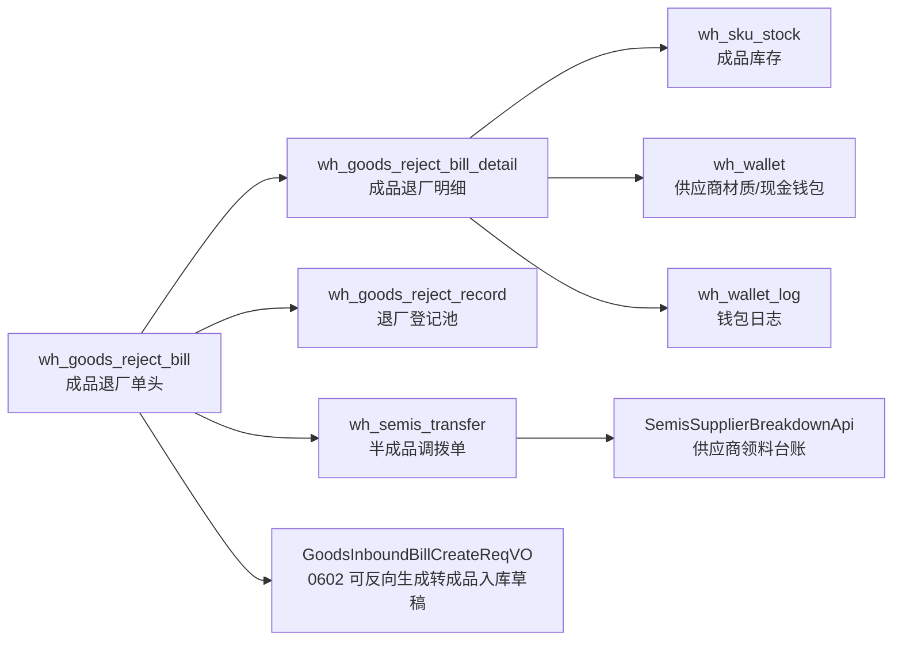

# 成品退厂单实体图

```mermaid
flowchart LR
    A["wh_goods_reject_bill\n成品退厂单头"] --> B["wh_goods_reject_bill_detail\n成品退厂明细"]
    A --> C["wh_goods_reject_record\n退厂登记池"]
    A --> D["wh_semis_transfer\n半成品调拨单"]
    B --> E["wh_sku_stock\n成品库存"]
    B --> F["wh_wallet\n供应商材质/现金钱包"]
    B --> G["wh_wallet_log\n钱包日志"]
    D --> H["SemisSupplierBreakdownApi\n供应商领料台账"]
    A --> I["GoodsInboundBillCreateReqVO\n0602 可反向生成转成品入库草稿"]
```

## 说明
1. `0601` 主要挂接退厂登记池。
2. `0602` 主要挂接半成品调拨单，并继续同步供应商领料台账。
3. 审核/反审始终同时影响成品库存和供应商钱包。
