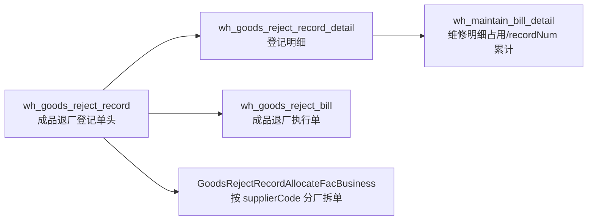

# 成品退厂登记单实体图

```mermaid
flowchart LR
    A["wh_goods_reject_record\n成品退厂登记单头"] --> B["wh_goods_reject_record_detail\n登记明细"]
    A --> C["wh_goods_reject_bill\n成品退厂执行单"]
    B --> D["wh_maintain_bill_detail\n维修明细占用/recordNum 累计"]
    A --> E["GoodsRejectRecordAllocateFacBusiness\n按 supplierCode 分厂拆单"]
```

## 说明
1. 登记单本身不直接改库存和钱包。
2. 它的核心价值是形成可退厂池，并被退厂执行单占用。
3. `0503` 维修登记会额外影响维修明细占用和累计数量。
