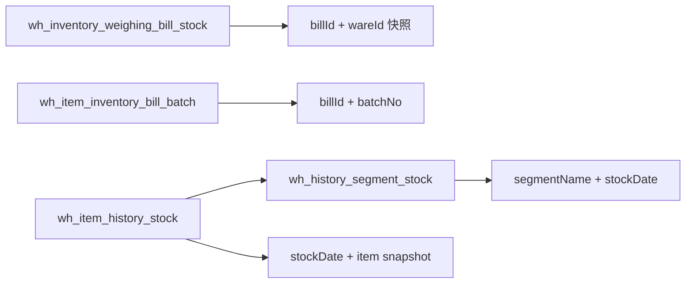

# 盘点批次与历史库存实体图

```mermaid
flowchart LR
    A["wh_inventory_weighing_bill_stock"] --> A1["billId + wareId 快照"]
    B["wh_item_inventory_bill_batch"] --> B1["billId + batchNo"]
    C["wh_item_history_stock"] --> D["wh_history_segment_stock"]
    C --> C1["stockDate + item snapshot"]
    D --> D1["segmentName + stockDate"]
```
