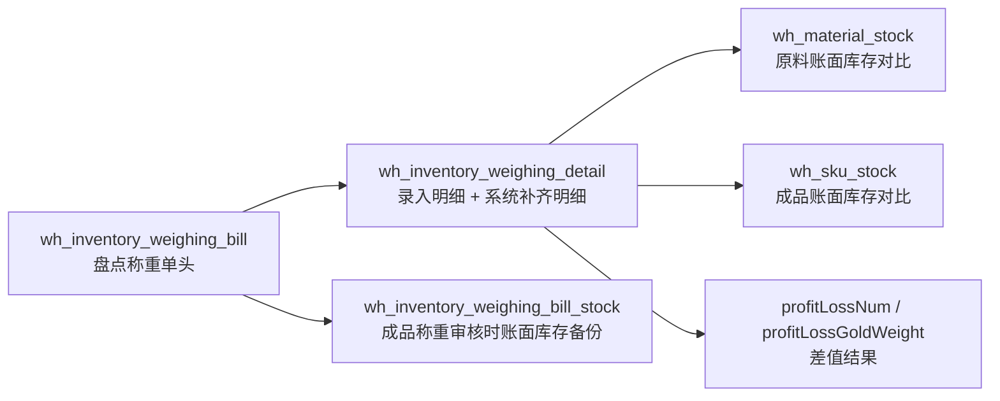

# 盘点称重单实体图

```mermaid
flowchart LR
    A["wh_inventory_weighing_bill\n盘点称重单头"] --> B["wh_inventory_weighing_detail\n录入明细 + 系统补齐明细"]
    B --> C["wh_material_stock\n原料账面库存对比"]
    B --> D["wh_sku_stock\n成品账面库存对比"]
    A --> E["wh_inventory_weighing_bill_stock\n成品称重审核时账面库存备份"]
    B --> F["profitLossNum / profitLossGoldWeight\n差值结果"]
```

## 说明
1. 明细既包含人工录入数据，也包含系统自动补齐的 `isGen = 1` 基线项。
2. 审核时真正生成的是“差值结果”，不是库存执行动作。
3. 原料称重和成品称重共表，但依赖的账面对比源不同。
