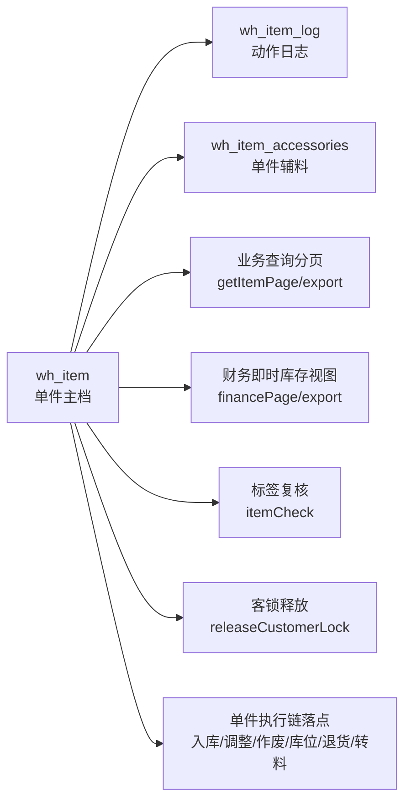

# 单件明细实体图

```mermaid
flowchart LR
    A["wh_item\n单件主档"] --> B["wh_item_log\n动作日志"]
    A --> C["wh_item_accessories\n单件辅料"]
    A --> D["业务查询分页\ngetItemPage/export"]
    A --> E["财务即时库存视图\nfinancePage/export"]
    A --> F["标签复核\nitemCheck"]
    A --> G["客锁释放\nreleaseCustomerLock"]
    A --> H["单件执行链落点\n入库/调整/作废/库位/退货/转料"]
```

## 说明
1. `wh_item` 既是单件主档，也是多条执行链共享的最终结果表。
2. 业务查询、财务查询、复核、客锁释放都建立在同一份单件主档之上。
3. 这也是为什么改单件执行链时，必须反查单件明细模块的展示与过滤口径。
