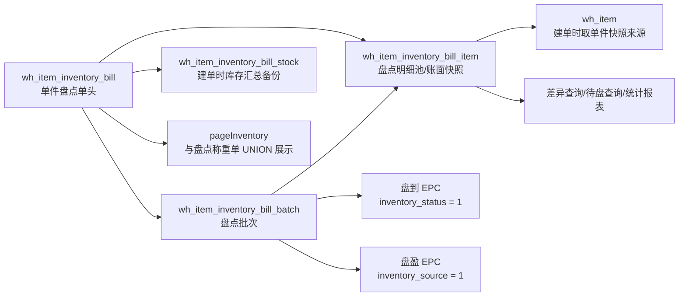

# 单件盘点单实体图

```mermaid
flowchart LR
    A["wh_item_inventory_bill\n单件盘点单头"] --> B["wh_item_inventory_bill_batch\n盘点批次"]
    A --> C["wh_item_inventory_bill_item\n盘点明细池/账面快照"]
    A --> D["wh_item_inventory_bill_stock\n建单时库存汇总备份"]
    C --> E["wh_item\n建单时取单件快照来源"]
    B --> C
    B --> F["盘到 EPC\ninventory_status = 1"]
    B --> G["盘盈 EPC\ninventory_source = 1"]
    C --> H["差异查询/待盘查询/统计报表"]
    A --> I["pageInventory\n与盘点称重单 UNION 展示"]
```

## 说明
1. 单件盘点单真正沉淀的是“账面快照 + 批次采集结果”，不是即时库存执行动作。
2. `wh_item_inventory_bill_item` 同时承载账面单件、已盘到单件和盘盈单件三种口径。
3. `wh_item_inventory_bill_stock` 是建单瞬间的库存汇总备份，和批次采集明细是两条并行基线。
