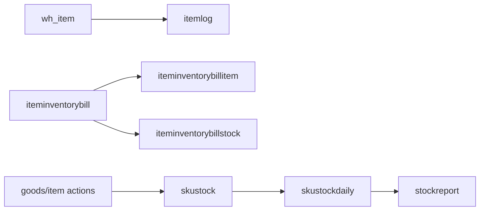

# 单件盘点与款式库存实体链路图

```mermaid
flowchart LR
    A["wh_item"] --> B["itemlog"]
    C["iteminventorybill"] --> D["iteminventorybillitem"]
    C --> E["iteminventorybillstock"]
    F["goods/item actions"] --> G["skustock"]
    G --> H["skustockdaily"]
    H --> I["stockreport"]
```
