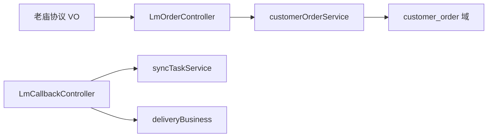

# 老庙订单与回调接口实体链

```mermaid
flowchart LR
    LM["老庙协议 VO"] --> ORDER["LmOrderController"]
    ORDER --> CUST["customerOrderService"]

    CALLBACK["LmCallbackController"] --> SYNC["syncTaskService"]
    CALLBACK --> DELIVERY["deliveryBusiness"]
    CUST --> CO["customer_order 域"]
```
