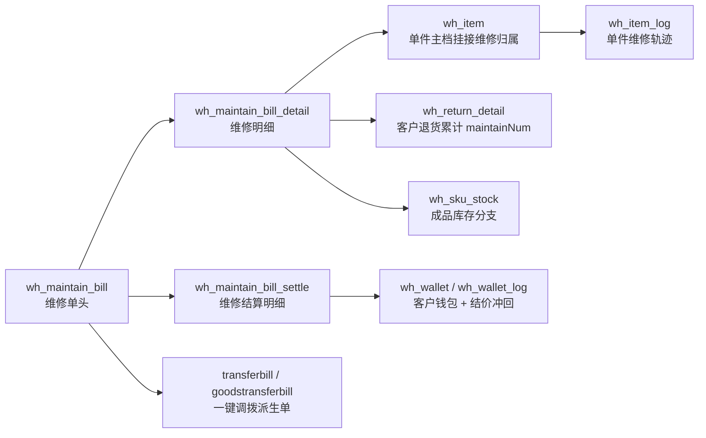

# 维修单实体图

```mermaid
flowchart LR
    A["wh_maintain_bill\n维修单头"] --> B["wh_maintain_bill_detail\n维修明细"]
    B --> C["wh_item\n单件主档挂接维修归属"]
    C --> D["wh_item_log\n单件维修轨迹"]
    B --> E["wh_return_detail\n客户退货累计 maintainNum"]
    A --> F["wh_maintain_bill_settle\n维修结算明细"]
    F --> G["wh_wallet / wh_wallet_log\n客户钱包 + 结价冲回"]
    B --> H["wh_sku_stock\n成品库存分支"]
    A --> I["transferbill / goodstransferbill\n一键调拨派生单"]
```

## 说明
1. 维修单是宿主链，明细才是大部分回写动作的锚点。
2. 客户维修单会同时把结算明细映射到钱包链，并对 `CLOSING_PRICE(02)` 单独冲回。
3. 单件维修和成品维修共用同一主表/明细表，但下游落点不同。
4. “一键调拨”不是维修单内改库存，而是派生成独立调拨单执行。
