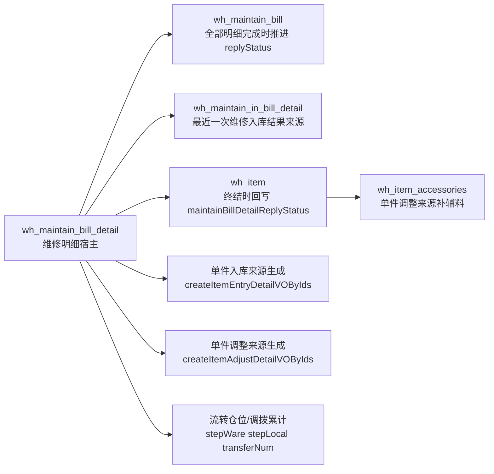

# 维修单详情实体图

```mermaid
flowchart LR
    A["wh_maintain_bill_detail\n维修明细宿主"] --> B["wh_maintain_bill\n全部明细完成时推进 replyStatus"]
    A --> C["wh_maintain_in_bill_detail\n最近一次维修入库结果来源"]
    A --> D["wh_item\n终结时回写 maintainBillDetailReplyStatus"]
    D --> E["wh_item_accessories\n单件调整来源补辅料"]
    A --> F["单件入库来源生成\ncreateItemEntryDetailVOByIds"]
    A --> G["单件调整来源生成\ncreateItemAdjustDetailVOByIds"]
    A --> H["流转仓位/调拨累计\nstepWare stepLocal transferNum"]
```

## 说明
1. 维修单详情是维修域明细宿主，不只是查询页。
2. 它上承维修单和维修入出库累计结果，下接单件入库、单件调整来源池。
3. 终结动作真正回写的是“维修明细 + 单件主档 + 维修单头聚合态”三层。
