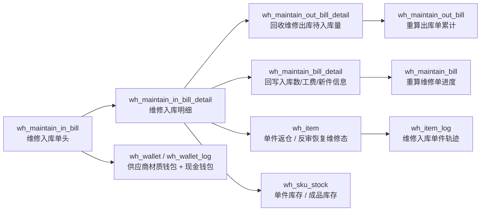

# 维修入库单实体图

```mermaid
flowchart LR
    A["wh_maintain_in_bill\n维修入库单头"] --> B["wh_maintain_in_bill_detail\n维修入库明细"]
    B --> C["wh_maintain_out_bill_detail\n回收维修出库待入库量"]
    C --> D["wh_maintain_out_bill\n重算出库单累计"]
    B --> E["wh_maintain_bill_detail\n回写入库数/工费/新件信息"]
    E --> F["wh_maintain_bill\n重算维修单进度"]
    B --> G["wh_item\n单件返仓 / 反审恢复维修态"]
    G --> H["wh_item_log\n维修入库单件轨迹"]
    B --> I["wh_sku_stock\n单件库存 / 成品库存"]
    A --> J["wh_wallet / wh_wallet_log\n供应商材质钱包 + 现金钱包"]
```

## 说明
1. 维修入库单最核心的两条来源链是维修单明细和维修出库明细。
2. 审核时会同时把“货回来了”和“供应商该结多少工费/材质”一起落账。
3. 单件维修与成品维修共用同一主表，但库存细节动作不同。
