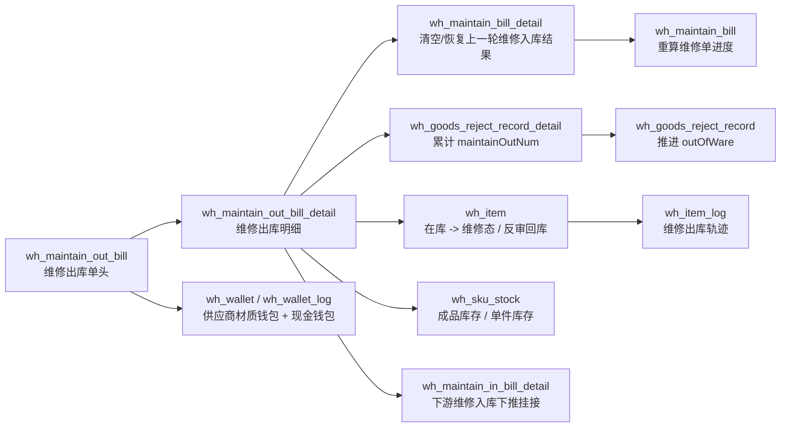

# 维修出库单实体图

```mermaid
flowchart LR
    A["wh_maintain_out_bill\n维修出库单头"] --> B["wh_maintain_out_bill_detail\n维修出库明细"]
    B --> C["wh_maintain_bill_detail\n清空/恢复上一轮维修入库结果"]
    C --> D["wh_maintain_bill\n重算维修单进度"]
    B --> E["wh_goods_reject_record_detail\n累计 maintainOutNum"]
    E --> F["wh_goods_reject_record\n推进 outOfWare"]
    B --> G["wh_item\n在库 -> 维修态 / 反审回库"]
    G --> H["wh_item_log\n维修出库轨迹"]
    B --> I["wh_sku_stock\n成品库存 / 单件库存"]
    A --> J["wh_wallet / wh_wallet_log\n供应商材质钱包 + 现金钱包"]
    B --> K["wh_maintain_in_bill_detail\n下游维修入库下推挂接"]
```

## 说明
1. 维修出库单既承接维修单，也承接退厂登记池。
2. 审核时最关键的不是“出库”本身，而是把维修单明细上一轮入库结果整组清空并备份。
3. 下游维修入库一旦承接，维修出库单反审就会被严格限制。
