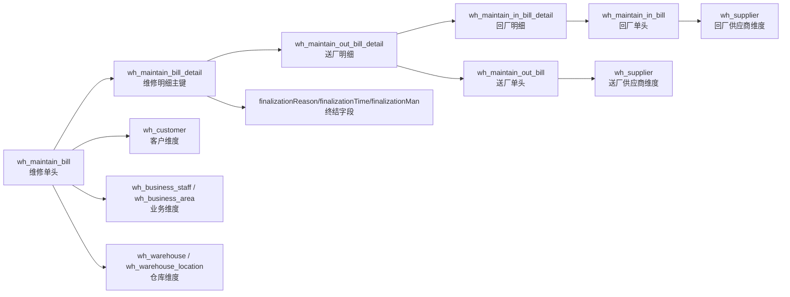

# 维修单报表实体图

```mermaid
flowchart LR
    A["wh_maintain_bill\n维修单头"] --> B["wh_maintain_bill_detail\n维修明细主键"]
    B --> C["wh_maintain_out_bill_detail\n送厂明细"]
    C --> D["wh_maintain_out_bill\n送厂单头"]
    C --> E["wh_maintain_in_bill_detail\n回厂明细"]
    E --> F["wh_maintain_in_bill\n回厂单头"]
    A --> G["wh_customer\n客户维度"]
    D --> H["wh_supplier\n送厂供应商维度"]
    F --> I["wh_supplier\n回厂供应商维度"]
    A --> J["wh_business_staff / wh_business_area\n业务维度"]
    A --> K["wh_warehouse / wh_warehouse_location\n仓库维度"]
    B --> L["finalizationReason/finalizationTime/finalizationMan\n终结字段"]
```

## 说明
1. 报表核心主键不是维修单头，而是 `wh_maintain_bill_detail`。
2. 它向前挂客户、业务、仓库维度，向后串送厂和回厂执行链。
3. 终结信息直接来自维修明细，而不是从别的执行单反推。
