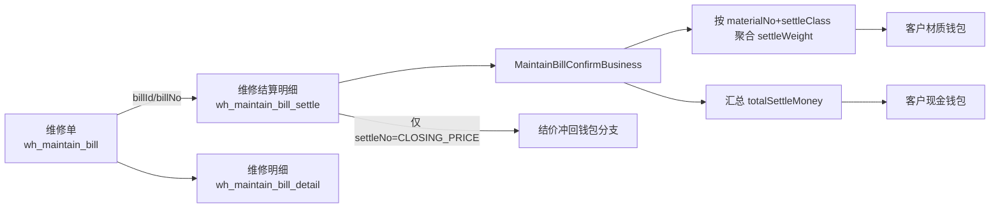

# 维修结算明细实体链路图

```mermaid
flowchart LR
    A["维修单
    wh_maintain_bill"] -->|billId/billNo| B["维修结算明细
    wh_maintain_bill_settle"]
    A --> C["维修明细
    wh_maintain_bill_detail"]

    B --> D["MaintainBillConfirmBusiness"]
    D --> E["按 materialNo+settleClass 聚合 settleWeight"]
    D --> F["汇总 totalSettleMoney"]

    E --> G["客户材质钱包"]
    F --> H["客户现金钱包"]
    B -->|仅 settleNo=CLOSING_PRICE| I["结价冲回钱包分支"]
```
