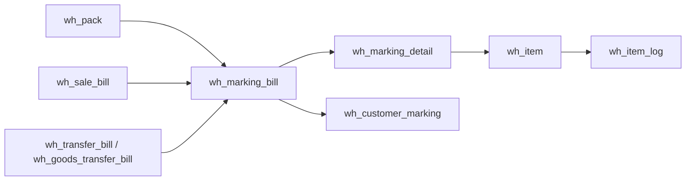

# 字印单实体图

```mermaid
flowchart LR
    PACK["wh_pack"] --> MB["wh_marking_bill"]
    SALE["wh_sale_bill"] --> MB
    TRANSFER["wh_transfer_bill / wh_goods_transfer_bill"] --> MB
    MB --> DETAIL["wh_marking_detail"]
    DETAIL --> ITEM["wh_item"]
    ITEM --> ITEMLOG["wh_item_log"]
    MB --> CM["wh_customer_marking"]
```
