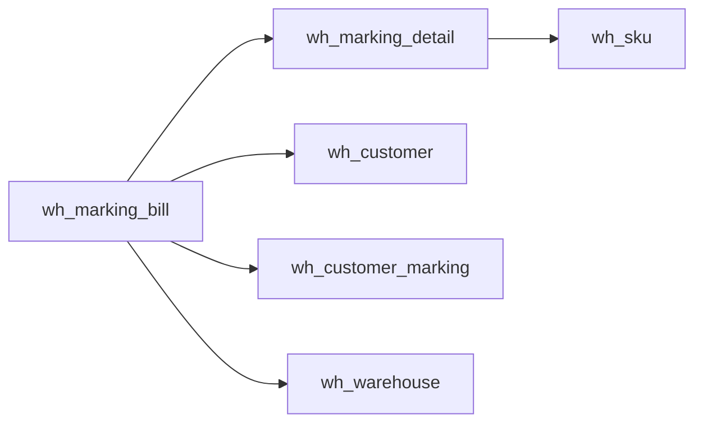

# 字印单明细实体图

```mermaid
flowchart LR
    BILL["wh_marking_bill"] --> DETAIL["wh_marking_detail"]
    DETAIL --> SKU["wh_sku"]
    BILL --> CUSTOMER["wh_customer"]
    BILL --> MARKING["wh_customer_marking"]
    BILL --> WARE["wh_warehouse"]
```
