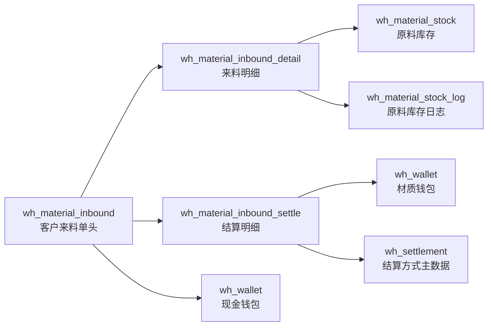

# 客户来料单实体图

```mermaid
flowchart LR
    A["wh_material_inbound\n客户来料单头"] --> B["wh_material_inbound_detail\n来料明细"]
    A --> C["wh_material_inbound_settle\n结算明细"]
    B --> D["wh_material_stock\n原料库存"]
    B --> E["wh_material_stock_log\n原料库存日志"]
    C --> F["wh_wallet\n材质钱包"]
    A --> G["wh_wallet\n现金钱包"]
    C --> H["wh_settlement\n结算方式主数据"]
```

## 说明
1. 库存链吃的是明细
2. 材质钱包主账吃的是结算明细
3. 现金钱包吃的是单头 `totalSettleMoney`
4. 结价冲回也依赖结算明细中的 `CLOSING_PRICE(02)`
