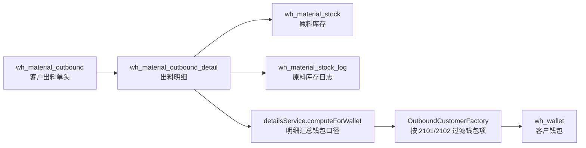

# 客户出料单实体图

```mermaid
flowchart LR
    A["wh_material_outbound\n客户出料单头"] --> B["wh_material_outbound_detail\n出料明细"]
    B --> C["wh_material_stock\n原料库存"]
    B --> D["wh_material_stock_log\n原料库存日志"]
    B --> E["detailsService.computeForWallet\n明细汇总钱包口径"]
    E --> F["OutboundCustomerFactory\n按 2101/2102 过滤钱包项"]
    F --> G["wh_wallet\n客户钱包"]
```

## 说明
1. 库存链固定是原料出库
2. 钱包链由 `2101/2102` 决定是走现金还是走材质
