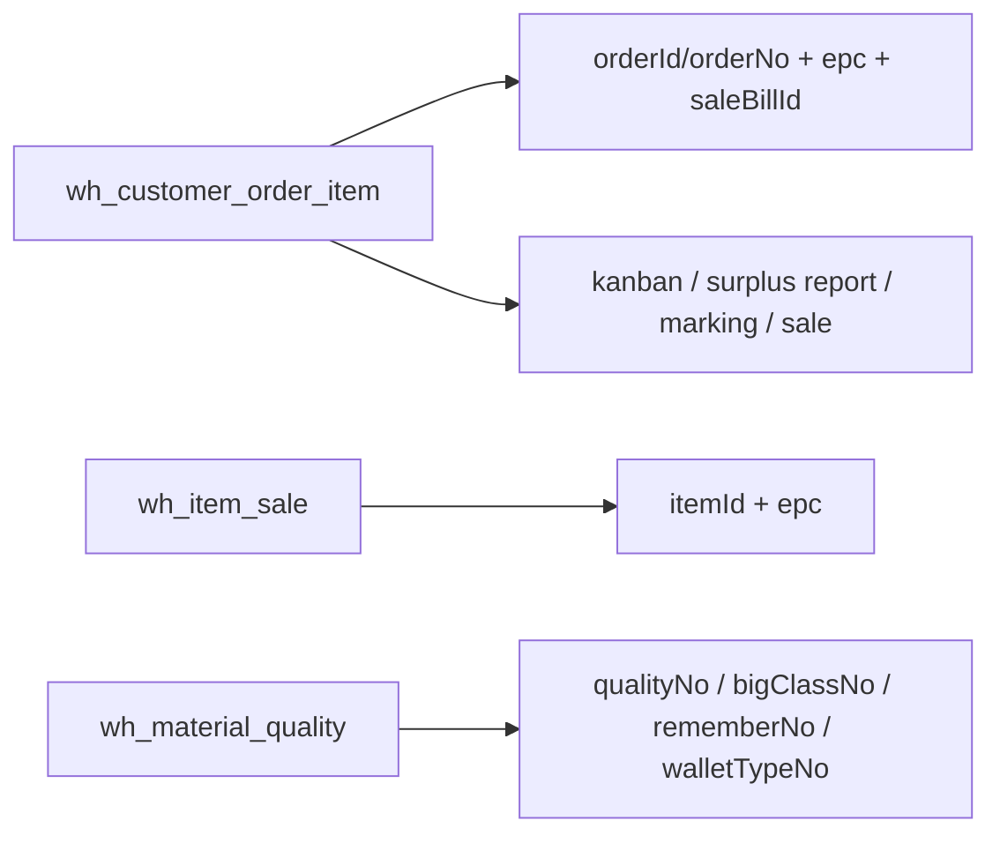

# 客户订单单件与原料品质尾项实体图

```mermaid
flowchart LR
    A["wh_customer_order_item"] --> A1["orderId/orderNo + epc + saleBillId"]
    A --> A2["kanban / surplus report / marking / sale"]
    B["wh_item_sale"] --> B1["itemId + epc"]
    C["wh_material_quality"] --> C1["qualityNo / bigClassNo / rememberNo / walletTypeNo"]
```
