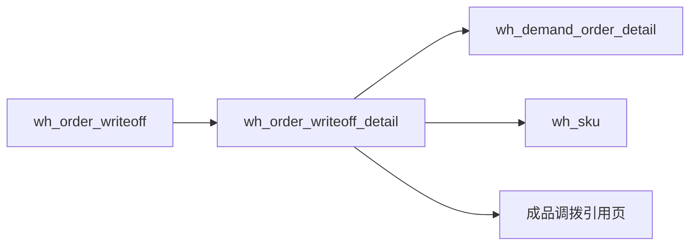

# 订单核销明细实体图

```mermaid
flowchart LR
    WRITEOFF["wh_order_writeoff"] --> DETAIL["wh_order_writeoff_detail"]
    DETAIL --> DEMAND["wh_demand_order_detail"]
    DETAIL --> SKU["wh_sku"]
    DETAIL --> TRANSFER["成品调拨引用页"]
```
