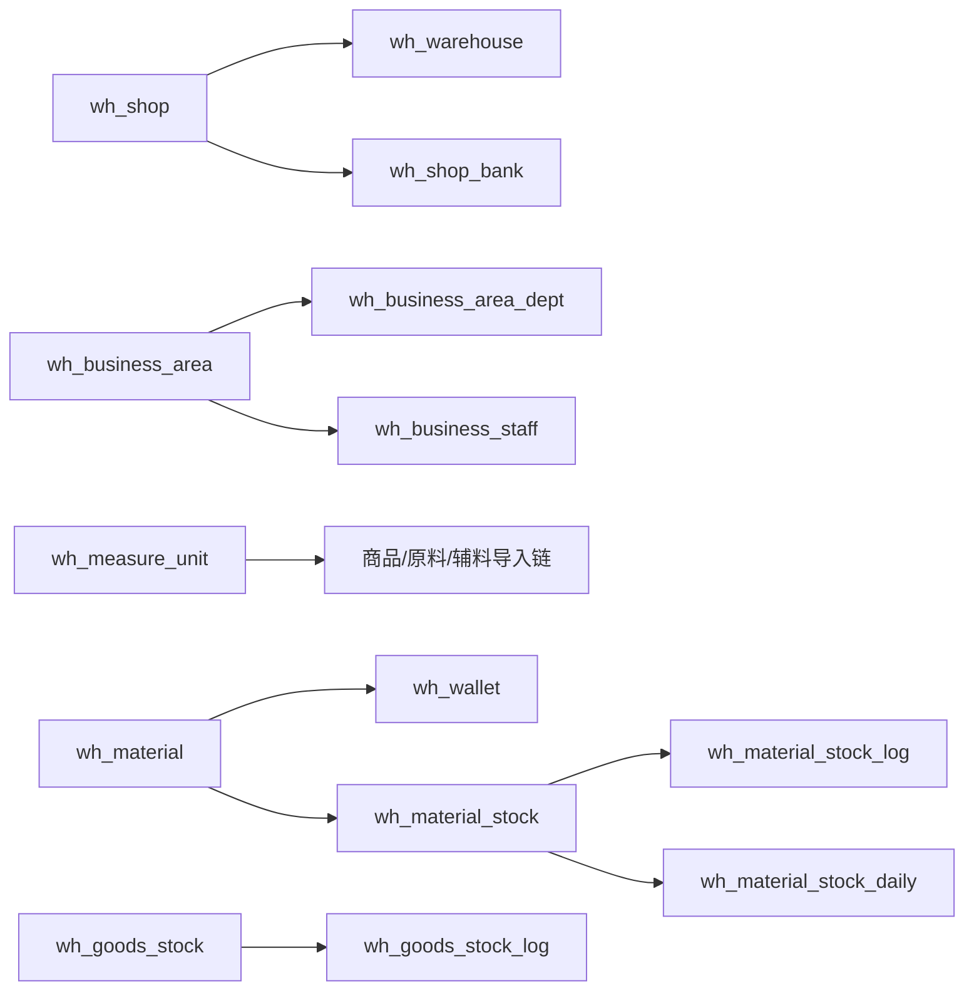

# 组织与库存主数据实体链

```mermaid
flowchart LR
    A["wh_shop"] --> B["wh_warehouse"]
    A --> C["wh_shop_bank"]
    D["wh_business_area"] --> E["wh_business_area_dept"]
    D --> F["wh_business_staff"]
    G["wh_measure_unit"] --> H["商品/原料/辅料导入链"]
    I["wh_material"] --> J["wh_wallet"]
    I --> K["wh_material_stock"]
    K --> L["wh_material_stock_log"]
    K --> M["wh_material_stock_daily"]
    N["wh_goods_stock"] --> O["wh_goods_stock_log"]
```
