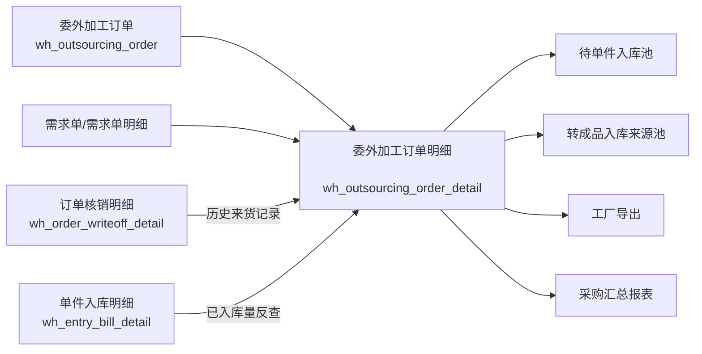

# 委外加工订单明细实体链路图

```mermaid
flowchart LR
    A["委外加工订单
    wh_outsourcing_order"] --> B["委外加工订单明细
    wh_outsourcing_order_detail"]
    C["需求单/需求单明细"] --> B

    D["订单核销明细
    wh_order_writeoff_detail"] -->|历史来货记录| B
    E["单件入库明细
    wh_entry_bill_detail"] -->|已入库量反查| B

    B --> F["待单件入库池"]
    B --> G["转成品入库来源池"]
    B --> H["工厂导出"]
    B --> I["采购汇总报表"]
```
