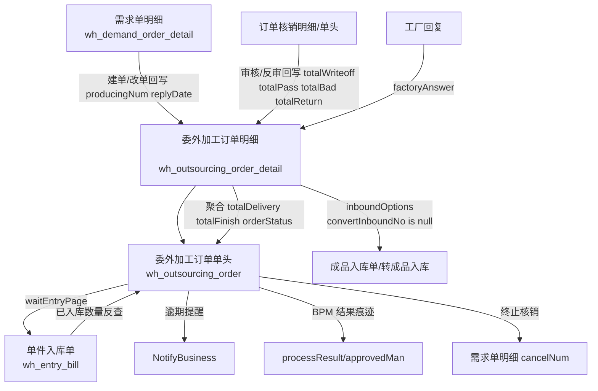

# 委外加工订单实体链路图

```mermaid
flowchart TD
    A["需求单明细
    wh_demand_order_detail"] -->|建单/改单回写 producingNum replyDate| B["委外加工订单明细
    wh_outsourcing_order_detail"]
    B --> C["委外加工订单单头
    wh_outsourcing_order"]

    D["订单核销明细/单头"] -->|审核/反审回写 totalWriteoff totalPass totalBad totalReturn| B
    B -->|聚合 totalDelivery totalFinish orderStatus| C

    C -->|waitEntryPage| E["单件入库单
    wh_entry_bill"]
    E -->|已入库数量反查| C

    B -->|inboundOptions
    convertInboundNo is null| F["成品入库单/转成品入库"]

    C -->|逾期提醒| G["NotifyBusiness"]
    C -->|BPM 结果痕迹| H["processResult/approvedMan"]

    I["工厂回复"] -->|factoryAnswer| B
    C -->|终止核销| J["需求单明细 cancelNum"]
```
