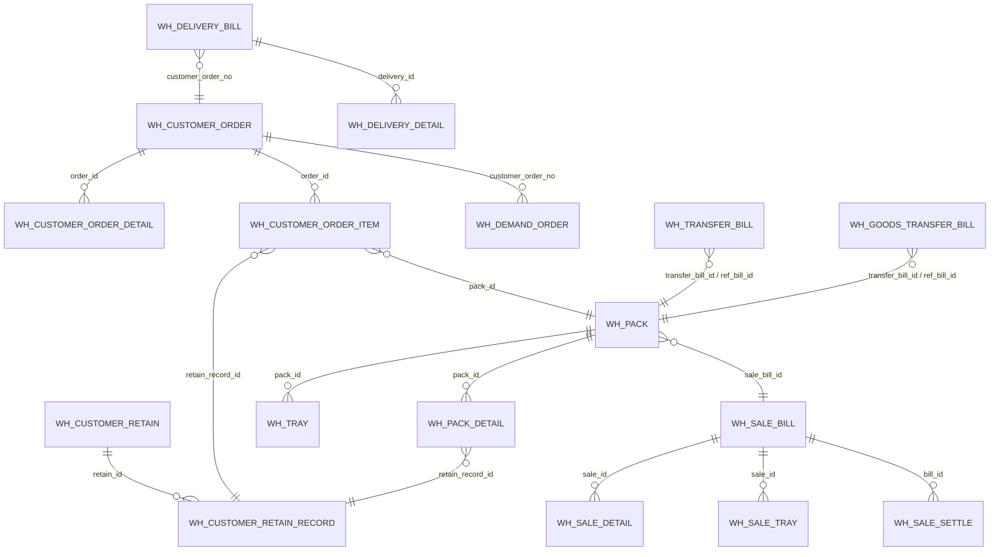

# 核心实体总览
> 基于 commit: `48af575a1314636c88e9f05ca3cb4443f88865bd`，日期：2026-03-31

## 说明
- 本图只覆盖当前已分析清楚的核心交易实体。
- 关系只采信主外键字段、查询条件、回写字段、聚合读取与批量更新，不依据注释猜测。
- 当前重点覆盖“客户订单 -> 客留存 -> 产品包 -> 调拨/结算/出货”主链。

## Mermaid

## 核心关系说明

### 客户订单
- `wh_customer_order` 是订单主表。
- `wh_customer_order_detail.order_id` 归属于订单主表。
- `wh_customer_order_item.order_id` 归属于订单主表，并承载后续 `RETAIN / BILLING / SETTLEMENT / BILLED / SHIPPED` 等本地状态。

### 客留存
- `wh_customer_retain_record.retain_id` 归属于 `wh_customer_retain`。
- `wh_customer_order_item.retain_record_id`、`wh_pack_detail.retain_record_id` 说明客留存明细会被订单明细和产品包明细共同引用。

### 产品包
- `wh_pack_detail.pack_id`、`wh_tray.pack_id` 归属于 `wh_pack`。
- `wh_customer_order_item.pack_id` 说明订单明细会在打包后绑定产品包。
- `wh_pack.sale_bill_id / sale_bill_no` 说明产品包会被结算单挂接。

### 调拨
- `wh_pack.transfer_bill_id / transfer_bill_no / transfer_type / transfer_status` 说明产品包会被单件调拨单或成品调拨单回写。
- 调拨模块以“源单回写”方式反向更新产品包，而不是产品包主动持有完整调拨明细。

### 结算与出货
- `wh_sale_detail.sale_id`、`wh_sale_tray.sale_id`、`wh_sale_settle.bill_id` 归属于 `wh_sale_bill`。
- `wh_pack.sale_bill_id` 说明结算单与产品包是一对多关系。
- `wh_delivery_bill.customer_order_no` 说明出货单最终按客户订单号回写订单出货结果。

## 证据来源
- 客户订单与订单明细/订单项：
  - [customerorder.md](/D:/ws/code/wms-api/docs/business/customerorder.md)
  - [customerorder-intent.md](/D:/ws/code/wms-api/docs/business/customerorder-intent.md)
- 客留存与客留存明细：
  - [customerretain.md](/D:/ws/code/wms-api/docs/business/customerretain.md)
- 产品包：
  - [pack.md](/D:/ws/code/wms-api/docs/business/pack.md)
- 调拨链：
  - [transferbill.md](/D:/ws/code/wms-api/docs/business/transferbill.md)
  - [goodstransferbill.md](/D:/ws/code/wms-api/docs/business/goodstransferbill.md)
- 结算与出货：
  - [salebill.md](/D:/ws/code/wms-api/docs/business/salebill.md)
  - [deliverybill.md](/D:/ws/code/wms-api/docs/business/deliverybill.md)
