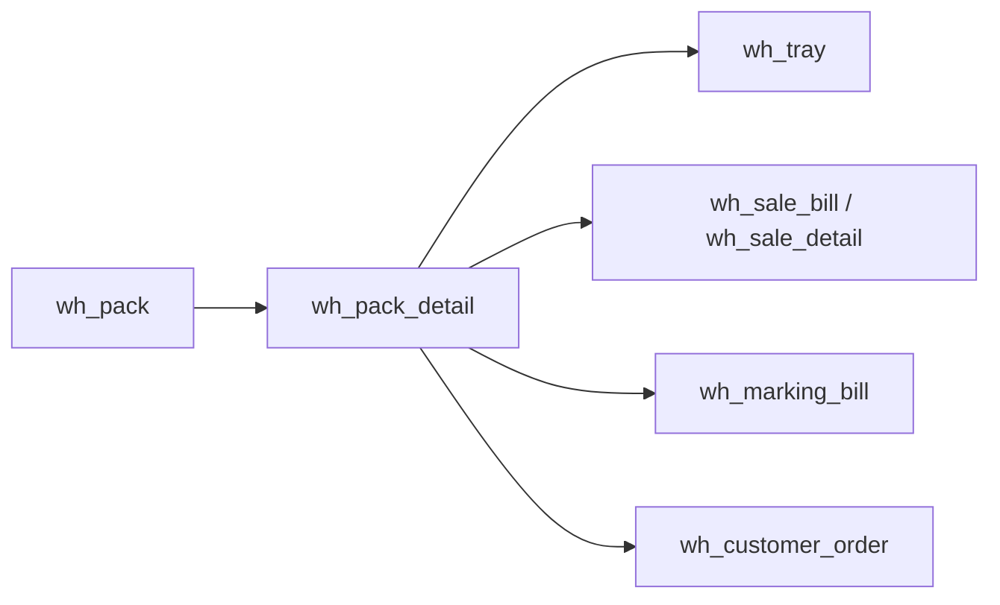

# 产品包明细实体图

```mermaid
flowchart LR
    PACK["wh_pack"] --> DETAIL["wh_pack_detail"]
    DETAIL --> TRAY["wh_tray"]
    DETAIL --> SALE["wh_sale_bill / wh_sale_detail"]
    DETAIL --> MARKING["wh_marking_bill"]
    DETAIL --> ORDER["wh_customer_order"]
```
