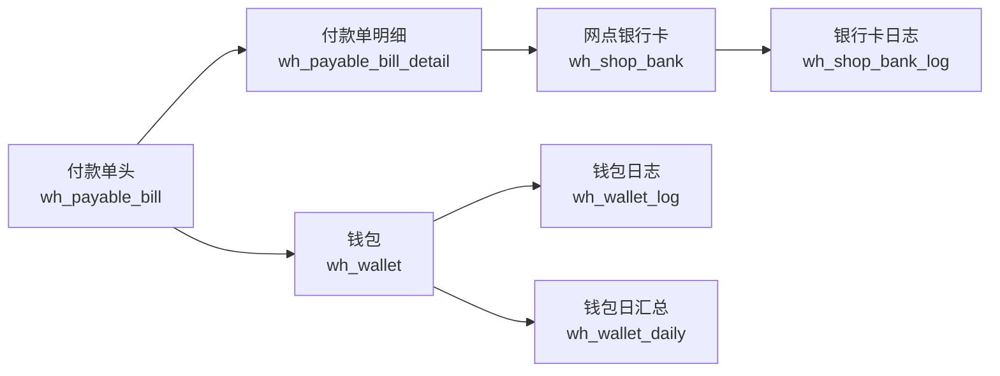

# 付款单资金链实体图
> 基于 commit: `48af575a1314636c88e9f05ca3cb4443f88865bd`，日期：2026-03-31

## 适用范围
- 付款单审核/反审时对银行卡与钱包双资金链的回写。
- 付款单导入后落单，再由审核动作正式驱动资金出账。

## Mermaid

## 关键关系
| 来源 | 目标 | 关系 |
|------|------|------|
| `wh_payable_bill` | `wh_payable_bill_detail` | 一对多，表头金额由明细金额汇总 |
| `wh_payable_bill_detail.bankCode` | `wh_shop_bank.bank_code` | 审核/反审时按银行账号逐条更新银行卡余额 |
| `wh_payable_bill.account_id` | `wh_wallet.account_id` | 审核/反审时按付款对象账户更新现金钱包 |

## 关键回写字段
| 目标表 | 字段 | 来源动作 |
|------|------|------|
| `wh_shop_bank` | `balance` | `confirm/unConfirm` |
| `wh_shop_bank_log` | `balanceBefore/balanceDiff/balanceAfter/billStatus` | `confirm/unConfirm` |
| `wh_wallet` | `balance` | `confirm/unConfirm` |
| `wh_wallet_log` | `balanceBefore/balanceDiff/balanceAfter/bizNo/billStatus/accountingType` | `confirm/unConfirm` |
| `wh_wallet_daily` | `balance` | `confirm/unConfirm` |

## 关键说明
1. 付款单审核时，银行侧按明细金额逐条扣减，钱包侧按表头总金额整体增加。
2. 付款单反审时，银行侧把余额加回，钱包侧把累计金额扣回。
3. 付款单没有像收款单那样的分账链，钱包归属始终围绕单头 `account_id`。
