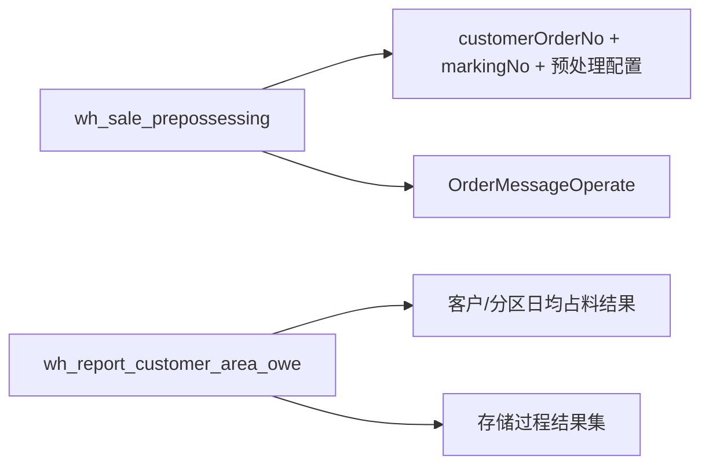

# 预处理与占料分析尾项实体图

```mermaid
flowchart LR
    A["wh_sale_prepossessing"] --> A1["customerOrderNo + markingNo + 预处理配置"]
    A --> A2["OrderMessageOperate"]
    B["wh_report_customer_area_owe"] --> B1["客户/分区日均占料结果"]
    B --> B2["存储过程结果集"]
```
