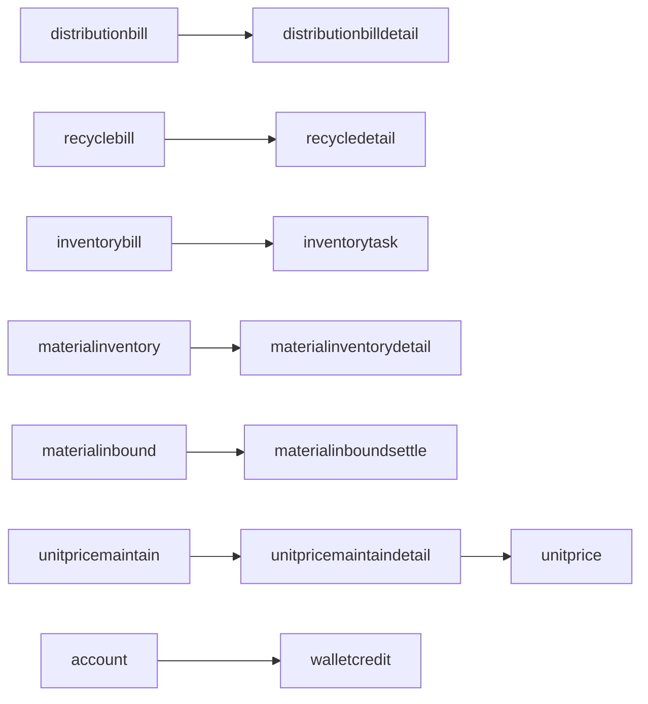

# 价格、盘点与铺货尾项实体链路图

```mermaid
flowchart LR
    A["distributionbill"] --> B["distributionbilldetail"]
    C["recyclebill"] --> D["recycledetail"]
    E["inventorybill"] --> F["inventorytask"]
    G["materialinventory"] --> H["materialinventorydetail"]
    I["materialinbound"] --> J["materialinboundsettle"]
    K["unitpricemaintain"] --> L["unitpricemaintaindetail"] --> M["unitprice"]
    N["account"] --> O["walletcredit"]
```
