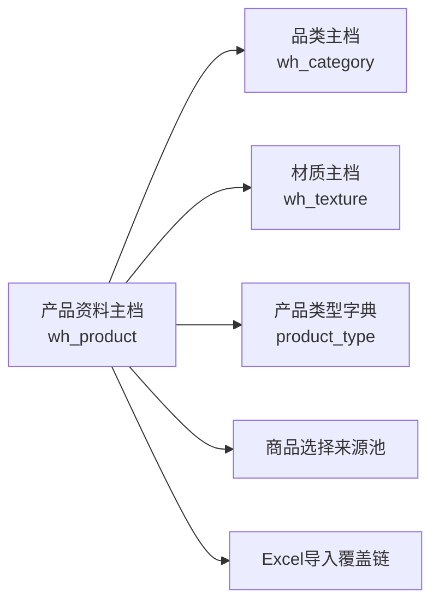

# 产品资料实体链路图

```mermaid
flowchart LR
    A["产品资料主档<br/>wh_product"] --> B["品类主档<br/>wh_category"]
    A --> C["材质主档<br/>wh_texture"]
    A --> D["产品类型字典<br/>product_type"]
    A --> E["商品选择来源池"]
    A --> F["Excel导入覆盖链"]
```
