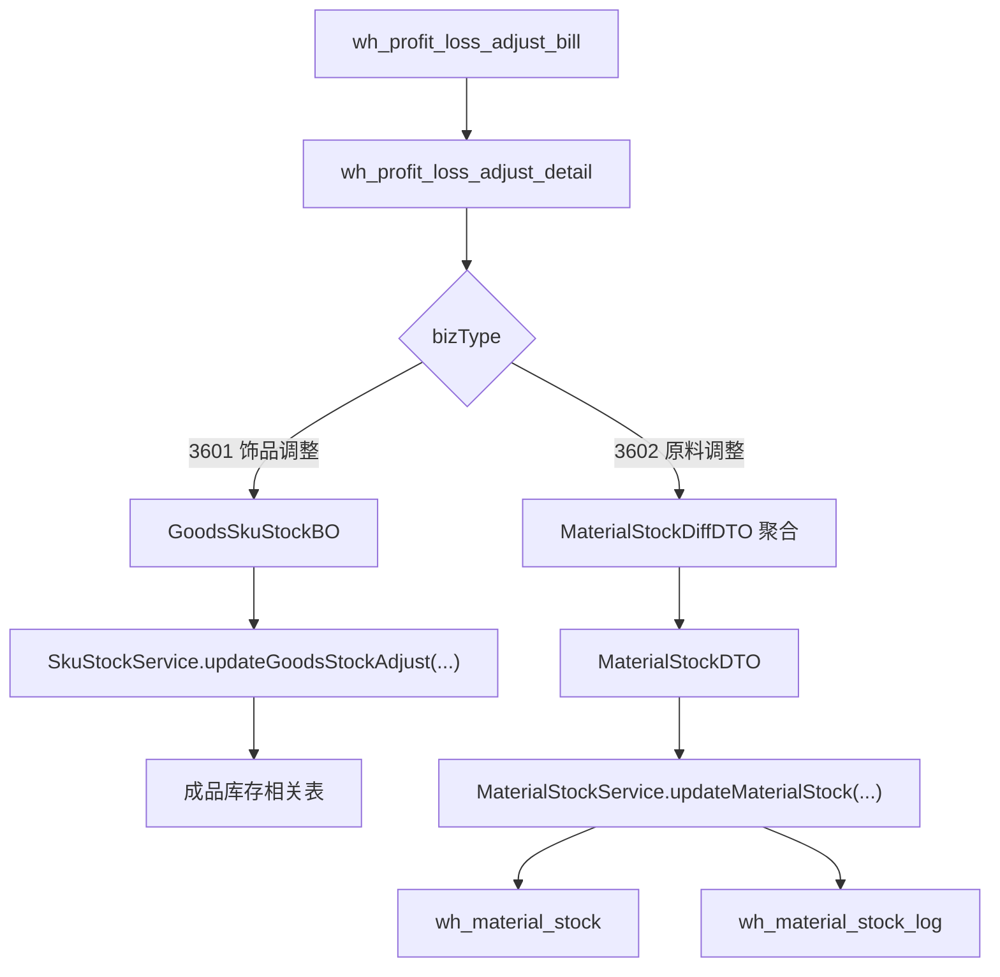

# 盈亏调整单实体关系图
> 说明：盈亏调整单按 `bizType` 分成“饰品库存调整链”和“原料库存调整链”

```mermaid
flowchart TD
    A["wh_profit_loss_adjust_bill"] --> B["wh_profit_loss_adjust_detail"]

    B --> C{"bizType"}

    C -->|"3601 饰品调整"| D["GoodsSkuStockBO"]
    D --> E["SkuStockService.updateGoodsStockAdjust(...)"]
    E --> F["成品库存相关表"]

    C -->|"3602 原料调整"| G["MaterialStockDiffDTO 聚合"]
    G --> H["MaterialStockDTO"]
    H --> I["MaterialStockService.updateMaterialStock(...)"]
    I --> J["wh_material_stock"]
    I --> K["wh_material_stock_log"]
```

## 说明
- 单头和明细是业务主链。
- `3601` 直接把明细件数/金重送入成品库存调整服务。
- `3602` 先按 `materialNo` 聚合金重差额，再统一落原料库存和库存日志。
- 盈亏调整单不进入钱包链。
