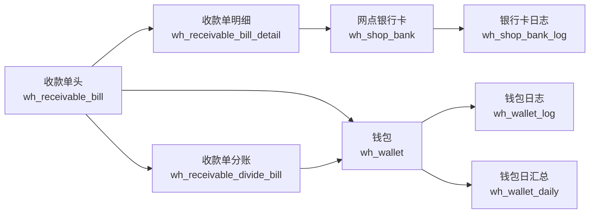

# 收款单资金链实体图
> 基于 commit: `48af575a1314636c88e9f05ca3cb4443f88865bd`，日期：2026-03-31

## 适用范围
- 收款单审核/反审时对银行卡与钱包的双链回写。
- 收款单分账/取消分账时对钱包归属的重分配。

## Mermaid

## 关键关系
| 来源 | 目标 | 关系 |
|------|------|------|
| `wh_receivable_bill` | `wh_receivable_bill_detail` | 一对多，头表金额由明细金额汇总 |
| `wh_receivable_bill.bill_no` | `wh_receivable_divide_bill.bill_no` | 一对多，分账记录归属收款单号 |
| `wh_receivable_bill_detail.bankCode` | `wh_shop_bank.bank_code` | 审核/反审时按银行账号更新银行卡余额 |
| `wh_receivable_bill.account_id` / 分账 `account_id` | `wh_wallet.account_id` | 审核/分账/取消分账时按账户更新钱包 |

## 关键回写字段
| 目标表 | 字段 | 来源动作 |
|------|------|------|
| `wh_shop_bank` | `balance` | `confirm/unConfirm` |
| `wh_shop_bank_log` | `balanceBefore/balanceDiff/balanceAfter/billStatus` | `confirm/unConfirm` |
| `wh_wallet` | `balance` | `confirm/unConfirm/divide/unDivide` |
| `wh_wallet_log` | `balanceBefore/balanceDiff/balanceAfter/bizNo/billStatus` | `confirm/divide/unDivide` |
| `wh_wallet_daily` | `balance` | `confirm/unConfirm/divide/unDivide` |
| `wh_receivable_divide_bill` | `bill_no/account_id/total_amount` | `divide/unDivide` |

## 关键说明
1. 审核/反审会同时改“银行账”和“钱包账”。
2. 分账/取消分账不会重做银行账，只在钱包账上做归属重分配。
3. 钱包侧 `diffBalance = -totalAmount`，说明收款单在钱包账上按负债冲减口径处理。
