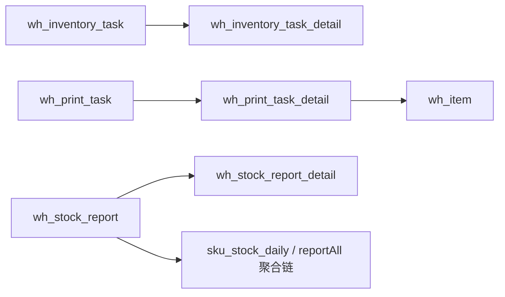

# 报表与任务实体链

```mermaid
flowchart LR
    A["wh_inventory_task"] --> B["wh_inventory_task_detail"]
    C["wh_print_task"] --> D["wh_print_task_detail"]
    D --> E["wh_item"]
    F["wh_stock_report"] --> G["wh_stock_report_detail"]
    F --> H["sku_stock_daily / reportAll 聚合链"]
```
