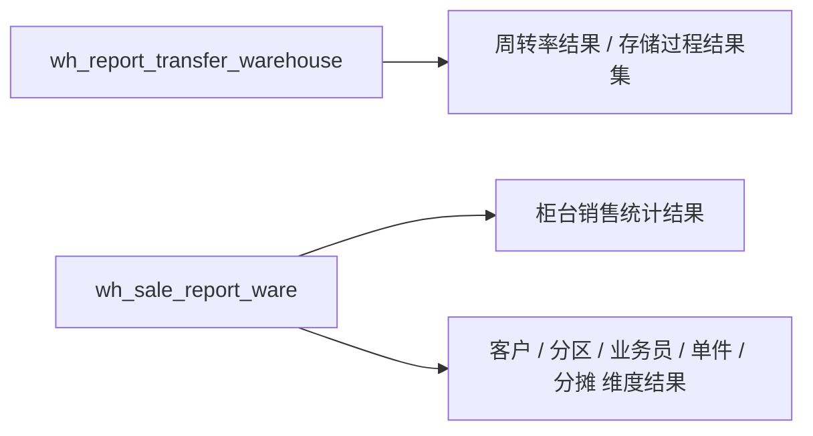

# 柜台与周转率报表尾项实体图

```mermaid
flowchart LR
    A["wh_report_transfer_warehouse"] --> A1["周转率结果 / 存储过程结果集"]
    B["wh_sale_report_ware"] --> B1["柜台销售统计结果"]
    B --> B2["客户 / 分区 / 业务员 / 单件 / 分摊 维度结果"]
```
