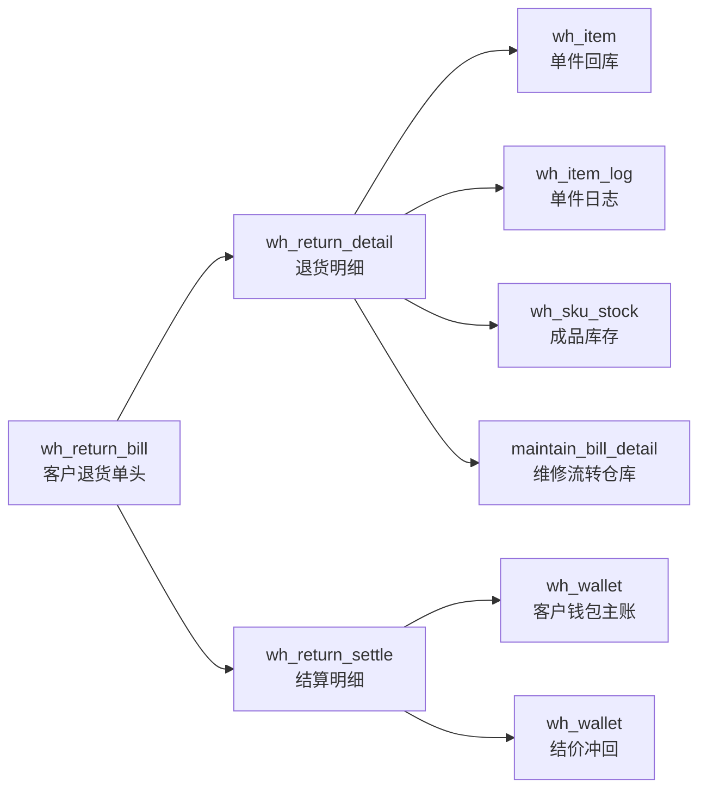

# 客户退货单实体图

```mermaid
flowchart LR
    A["wh_return_bill\n客户退货单头"] --> B["wh_return_detail\n退货明细"]
    A --> C["wh_return_settle\n结算明细"]
    B --> D["wh_item\n单件回库"]
    B --> E["wh_item_log\n单件日志"]
    B --> F["wh_sku_stock\n成品库存"]
    C --> G["wh_wallet\n客户钱包主账"]
    C --> H["wh_wallet\n结价冲回"]
    B --> I["maintain_bill_detail\n维修流转仓库"]
```

## 说明
1. 单件明细和成品明细共存于同一张退货单
2. 主账吃的是结算明细，不是直接吃商品明细
3. 结价冲回是主账之外的第二笔钱包动作
