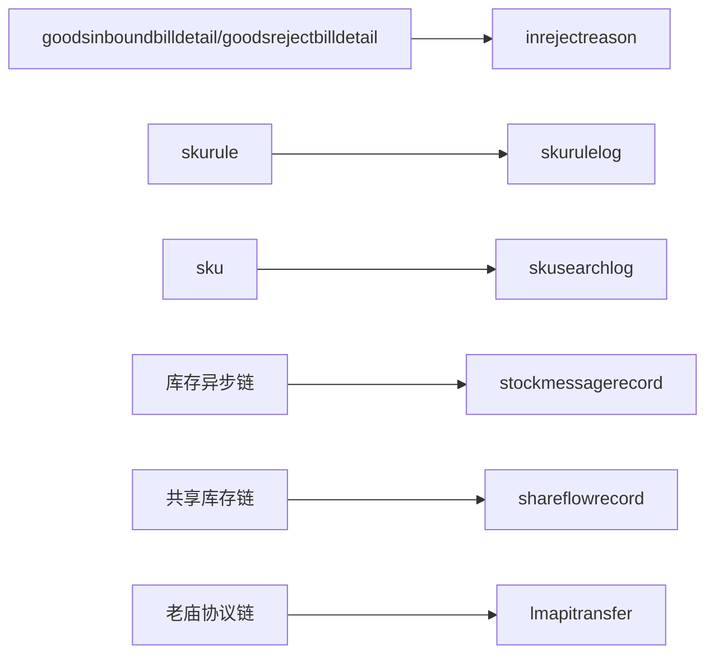

# 规则、日志与记录尾项实体链路图

```mermaid
flowchart LR
    A["goodsinboundbilldetail/goodsrejectbilldetail"] --> B["inrejectreason"]
    C["skurule"] --> D["skurulelog"]
    E["sku"] --> F["skusearchlog"]
    G["库存异步链"] --> H["stockmessagerecord"]
    I["共享库存链"] --> J["shareflowrecord"]
    K["老庙协议链"] --> L["lmapitransfer"]
```
