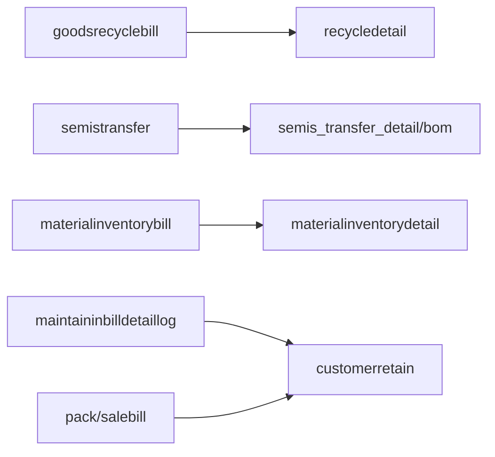

# 半成品、转料与客留尾项实体链路图

```mermaid
flowchart LR
    A["goodsrecyclebill"] --> B["recycledetail"]
    C["semistransfer"] --> D["semis_transfer_detail/bom"]
    E["materialinventorybill"] --> F["materialinventorydetail"]
    G["maintaininbilldetaillog"] --> H["customerretain"]
    I["pack/salebill"] --> H
```
