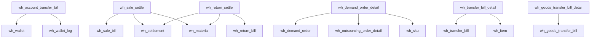

# 结算与调拨明细实体图

```mermaid
flowchart TD
    A["wh_account_transfer_bill"] --> B["wh_wallet"]
    A --> C["wh_wallet_log"]
    D["wh_sale_settle"] --> E["wh_sale_bill"]
    D --> F["wh_settlement"]
    D --> G["wh_material"]
    H["wh_return_settle"] --> I["wh_return_bill"]
    H --> F
    H --> G
    J["wh_demand_order_detail"] --> K["wh_demand_order"]
    J --> L["wh_outsourcing_order_detail"]
    J --> M["wh_sku"]
    N["wh_transfer_bill_detail"] --> O["wh_transfer_bill"]
    N --> P["wh_item"]
    Q["wh_goods_transfer_bill_detail"] --> R["wh_goods_transfer_bill"]
```
