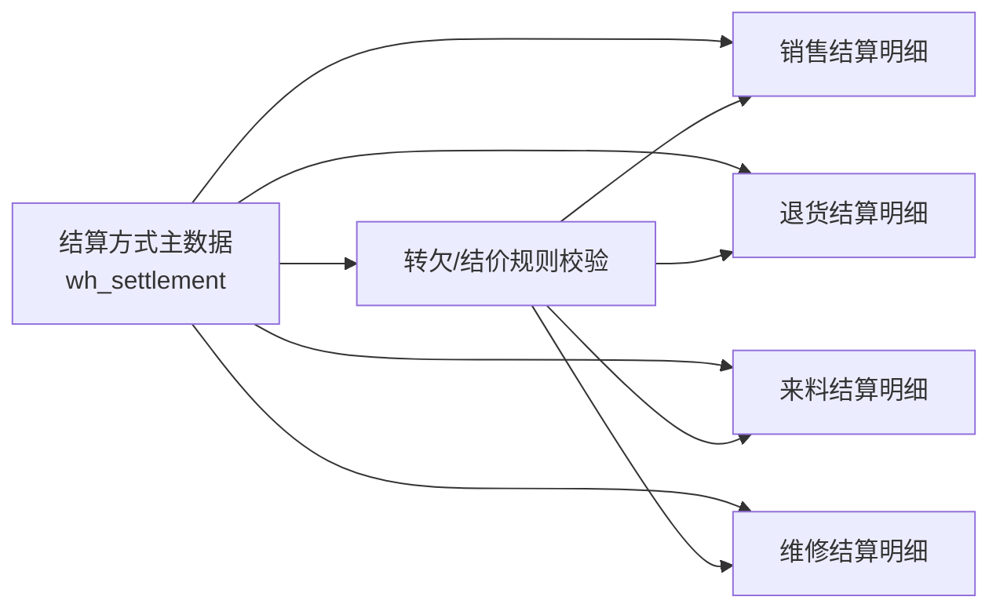

# 结算方式实体链路图

```mermaid
flowchart LR
    A["结算方式主数据
    wh_settlement"] --> B["销售结算明细"]
    A --> C["退货结算明细"]
    A --> D["来料结算明细"]
    A --> E["维修结算明细"]

    A --> F["转欠/结价规则校验"]
    F --> B
    F --> C
    F --> D
    F --> E
```
