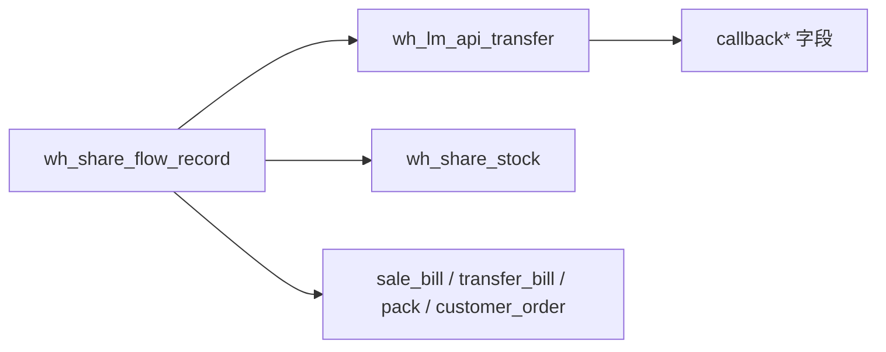

# 共享流水与老庙接口痕迹实体链

```mermaid
flowchart LR
    FLOW["wh_share_flow_record"] --> API["wh_lm_api_transfer"]
    FLOW --> SHARE["wh_share_stock"]
    FLOW --> SALE["sale_bill / transfer_bill / pack / customer_order"]
    API --> CALLBACK["callback* 字段"]
```
