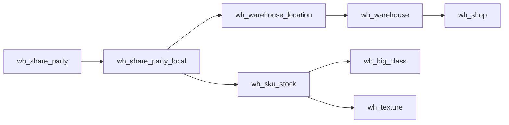

# 共享方实体链

```mermaid
flowchart LR
    PARTY["wh_share_party"] --> PARTYLOCAL["wh_share_party_local"]
    PARTYLOCAL --> STOCK["wh_sku_stock"]
    PARTYLOCAL --> LOCAL["wh_warehouse_location"]
    LOCAL --> WARE["wh_warehouse"]
    WARE --> SHOP["wh_shop"]
    STOCK --> BIG["wh_big_class"]
    STOCK --> TEX["wh_texture"]
```
