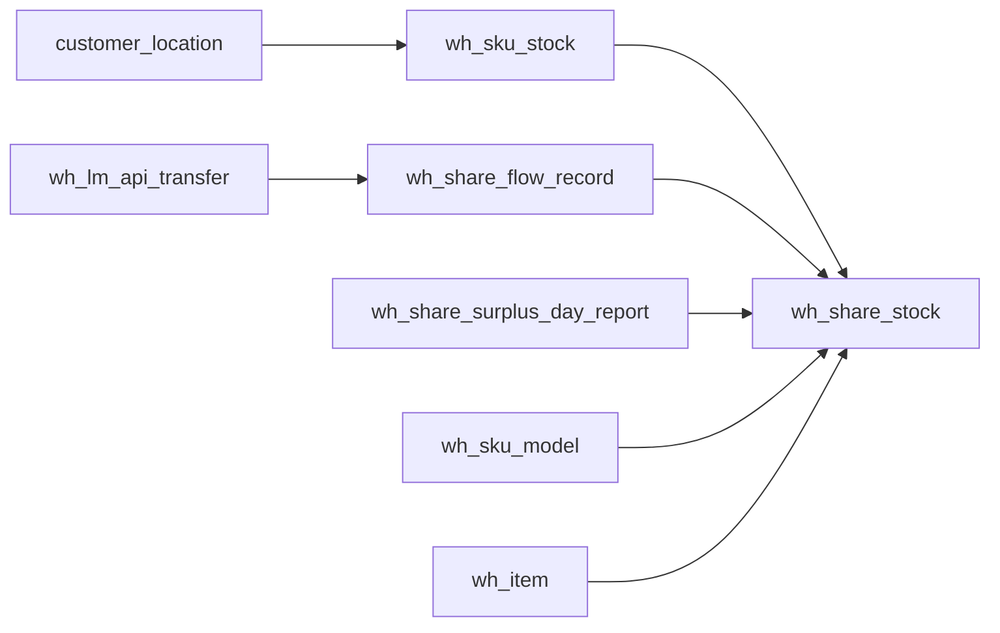

# 共享库存实体链

```mermaid
flowchart LR
    STOCK["wh_sku_stock"] --> SHARE["wh_share_stock"]
    FLOW["wh_share_flow_record"] --> SHARE
    API["wh_lm_api_transfer"] --> FLOW
    REPORT["wh_share_surplus_day_report"] --> SHARE
    MODEL["wh_sku_model"] --> SHARE
    ITEM["wh_item"] --> SHARE
    LOCAL["customer_location"] --> STOCK
```
