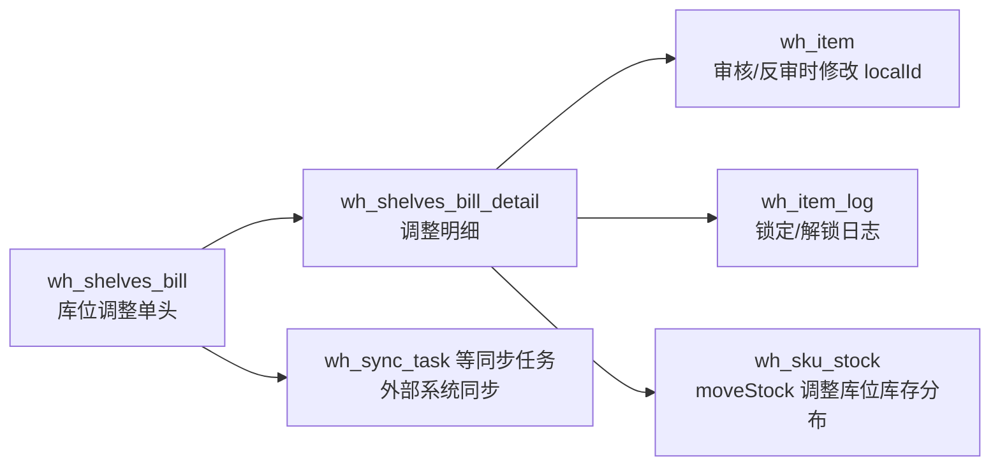

# 库位调整单实体图

```mermaid
flowchart LR
    A["wh_shelves_bill\n库位调整单头"] --> B["wh_shelves_bill_detail\n调整明细"]
    B --> C["wh_item\n审核/反审时修改 localId"]
    B --> D["wh_item_log\n锁定/解锁日志"]
    B --> E["wh_sku_stock\nmoveStock 调整库位库存分布"]
    A --> F["wh_sync_task 等同步任务\n外部系统同步"]
```

## 说明
1. 建单阶段先锁 EPC，审核阶段再真正动 `wh_item` 和 `wh_sku_stock`。
2. 明细上的 `sourLocalId/destLocalId` 是库存移动和反审回滚的关键锚点。
3. 外部同步不是附属查询，而是单据级正式侧链。
