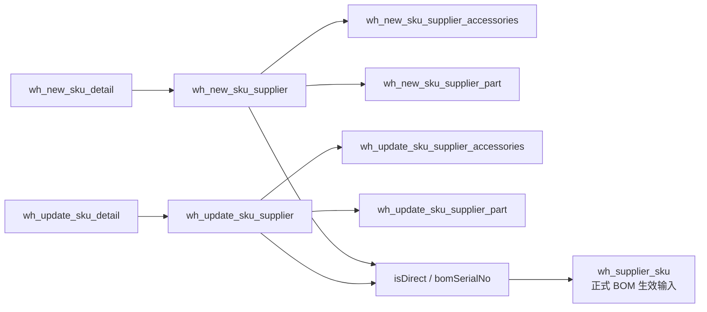

# SKU 审批域 BOM 缓存实体链路

```mermaid
flowchart LR
    A["wh_new_sku_detail"] --> B["wh_new_sku_supplier"]
    B --> C["wh_new_sku_supplier_accessories"]
    B --> D["wh_new_sku_supplier_part"]
    E["wh_update_sku_detail"] --> F["wh_update_sku_supplier"]
    F --> G["wh_update_sku_supplier_accessories"]
    F --> H["wh_update_sku_supplier_part"]
    B --> I["isDirect / bomSerialNo"]
    F --> I
    I --> J["wh_supplier_sku<br/>正式 BOM 生效输入"]
```
