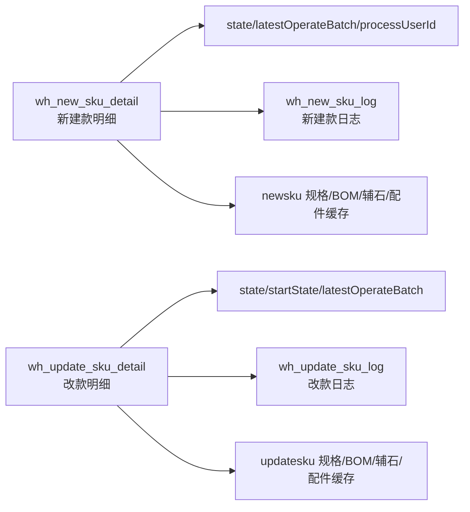

# SKU 审批域明细实体链路

```mermaid
flowchart LR
    A["wh_new_sku_detail<br/>新建款明细"] --> B["state/latestOperateBatch/processUserId"]
    A --> C["wh_new_sku_log<br/>新建款日志"]
    D["wh_update_sku_detail<br/>改款明细"] --> E["state/startState/latestOperateBatch"]
    D --> F["wh_update_sku_log<br/>改款日志"]
    A --> G["newsku 规格/BOM/辅石/配件缓存"]
    D --> H["updatesku 规格/BOM/辅石/配件缓存"]
```
