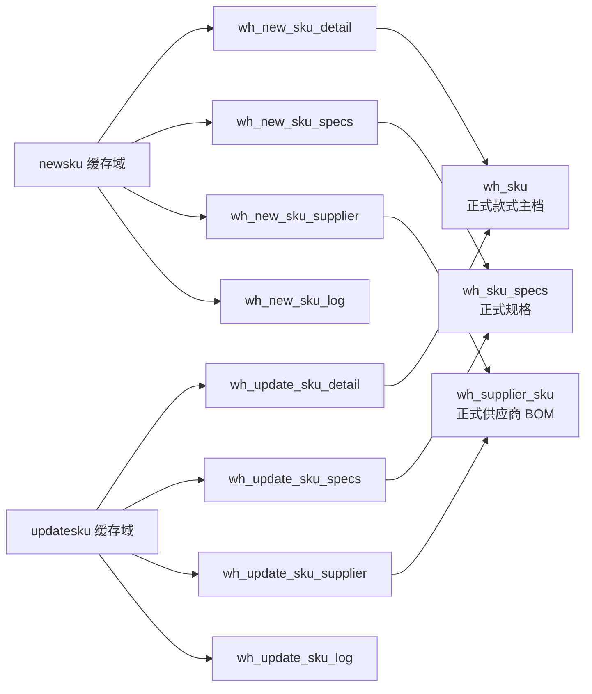

# SKU 新建/改款审批域实体链路

```mermaid
flowchart LR
    A["newsku 缓存域"] --> A1["wh_new_sku_detail"]
    A --> A2["wh_new_sku_specs"]
    A --> A3["wh_new_sku_supplier"]
    A --> A4["wh_new_sku_log"]
    B["updatesku 缓存域"] --> B1["wh_update_sku_detail"]
    B --> B2["wh_update_sku_specs"]
    B --> B3["wh_update_sku_supplier"]
    B --> B4["wh_update_sku_log"]
    A1 --> C["wh_sku<br/>正式款式主档"]
    B1 --> C
    A2 --> D["wh_sku_specs<br/>正式规格"]
    B2 --> D
    A3 --> E["wh_supplier_sku<br/>正式供应商 BOM"]
    B3 --> E
```
