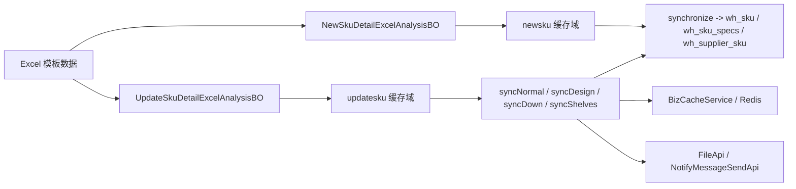

# SKU 审批域辅助链实体链路

```mermaid
flowchart LR
    A["Excel 模板数据"] --> B["NewSkuDetailExcelAnalysisBO"]
    A --> C["UpdateSkuDetailExcelAnalysisBO"]
    B --> D["newsku 缓存域"]
    C --> E["updatesku 缓存域"]
    D --> F["synchronize -> wh_sku / wh_sku_specs / wh_supplier_sku"]
    E --> G["syncNormal / syncDesign / syncDown / syncShelves"]
    G --> F
    G --> H["BizCacheService / Redis"]
    G --> I["FileApi / NotifyMessageSendApi"]
```
