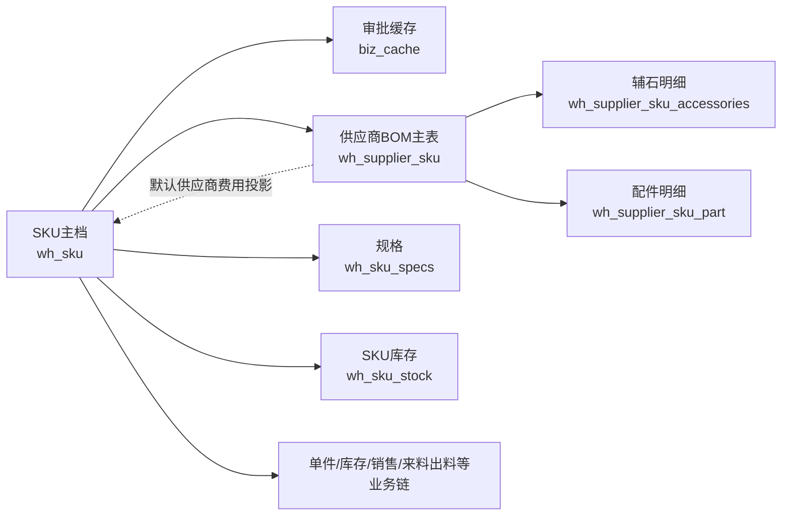

# 款式库实体链路图

```mermaid
flowchart LR
    A["SKU主档<br/>wh_sku"] --> B["审批缓存<br/>biz_cache"]
    A --> C["供应商BOM主表<br/>wh_supplier_sku"]
    C --> D["辅石明细<br/>wh_supplier_sku_accessories"]
    C --> E["配件明细<br/>wh_supplier_sku_part"]
    A --> F["规格<br/>wh_sku_specs"]
    A --> G["SKU库存<br/>wh_sku_stock"]
    A --> H["单件/库存/销售/来料出料等业务链"]

    C -.默认供应商费用投影.-> A
```
