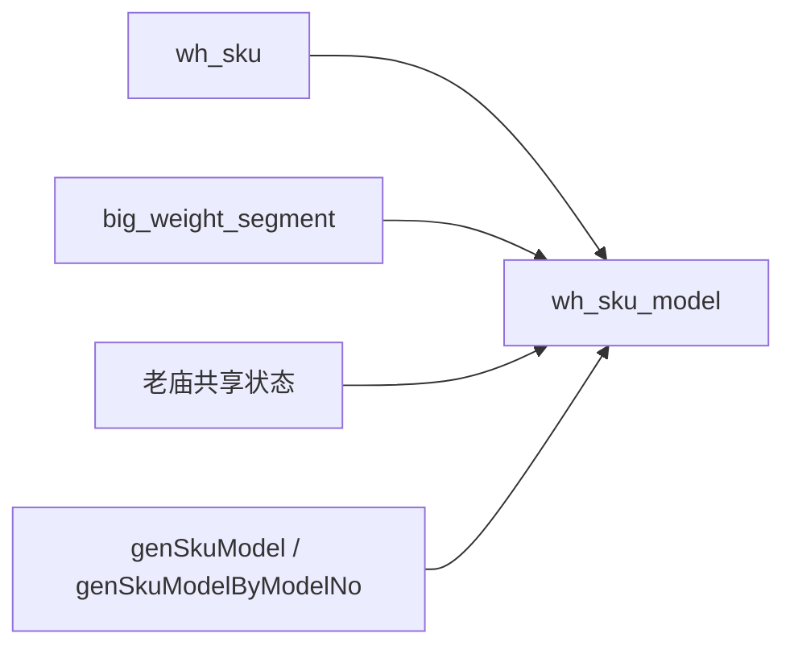

# 款式模号实体链

```mermaid
flowchart LR
    SKU["wh_sku"] --> MODEL["wh_sku_model"]
    SEG["big_weight_segment"] --> MODEL
    LM["老庙共享状态"] --> MODEL
    AUTO["genSkuModel / genSkuModelByModelNo"] --> MODEL
```
